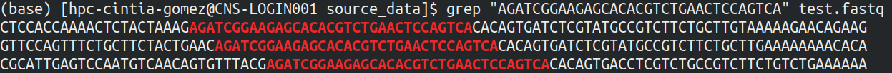

# Reads Quality and Trimming

Author: Cintia Gómez-Muñoz

Created: July 15, 2020

Updated: June 1, 2021

---

## Introduction

The next step is to examine the reads quality to later remove sequencing adapters and perform trimming and filtering (see below). For that, we can use **FastQC**<sup>1</sup>, which is a really easy tool to use. This tool gives you a report in **HTML** format that you can visually inspect in order to take decisions about your reads. Ideally, **FastQC** should be ran each time you perform modifications to your reads (rounds), so in order to keep things neat, you can create appropriate directories, for example:

```bash
mkdir quals
cd quals
mkdir qual_rnd1
```

## Initial quality assessment

Running **FastQC** is pretty straight forward, you just need to go to your desired directory or specify the complete route and run the following:

```bash
fastqc -o path_to/rna-seq-analysis/02_reads_qual/quals/qual_rnd1 -t 8 --noextract path_to/rna-seq-analysis/01_rna_seq_data/source_data/*.fastq
```

Remember that it would be better to run this process with `screen` (see '**RNA-Seq Introduction and Setup**'). You can use more threads in the super computer (`-t 32`). The information to run it in the server is in the **runFastQC_sbatch.sh** script.

```bash
sbatch path_to/runFastQC_sbatch.sh path_to/source_data path_to/quals/qual_rnd1
```

**FastQC** will generate one report per library. One form to compile all of the information into a single report is using **MultiQC**<sup>2</sup>. This program can be ran as follows:

```bash
multiqc path_to/rna-seq-analysis/02_reads_qual/qual_rnd1 -o path_to/rna-seq-analysis/02_reads_qual/qual_rnd1
```

The output is called **multiqc_report.html** and you can inspect it in a web explorer (for example, Chrome or Firefox). More information on [MultiQC](https://multiqc.info/).

## Remove sequencing adapters

In some cases, sequence adapters can be present if the read length is greater than the insert size. For that reason, the adapters should be remove from the sequences. In order to do so, one can use **Cutadapt**<sup>3</sup>. To run it, one need [to know the adapters sequences](https://support.illumina.com/bulletins/2016/12/what-sequences-do-i-use-for-adapter-trimming.html). This information is provided in the library preparation kit or is contained in the sample information of the sequencing instrument. In the case of the _Saccharomycopsis fibuligera_ paper, they used the TruSeq RNA Sample Prep Kit, which would mean that they used the following sequences:

```bash
>Read_1
AGATCGGAAGAGCACACGTCTGAAC
>Read_2
AGATCGGAAGAGCGTCGTGTAGGGA
```

To proof this, I searched for the adapter sequence using `grep` to make a sub-sample of the reads.

```bash
grep -B1 "AGATCGGAAGAGCACACGTCTGAACTCCAGTCA" SRR3598367_1.fastq | head > test.fastq
```

Then, I visualized the presence of sequences with the complete adapter.

```bash
grep "AGATCGGAAGAGCACACGTCTGAACTCCAGTCA" test.fastq
```



I also counted the number of sequences with the complete adapter.

```bash
grep "AGATCGGAAGAGCACACGTCTGAACTCCAGTCA" SRR3598367_1.fastq | wc -l
# outputs 9771
```

As you can see, this are the right adapters sequences and there are still some reads with them; therefore, we are going to proceed to remove them.

Create a new directory to perform the adapter removal and save there the **FASTA** file with your adapter sequences (in my case **TruSeq_adapters.fasta**).

```bash
mkdir cutadapt
```

To run **Cutadapt**, you need to apply the following command:

```bash
cutadapt -a ADAPTER_FWD -A ADAPTER_REV -o out.1.fastq -p out.2.fastq reads.1.fastq reads.2.fastq
```

To perform the process automatically to all libraries pairs, you can make a list file with the libraries information. For example, you can go to your `01_rna_seq_data/source_data` directory and do the following:

```bash
paste <(ls -d $PWD/*.fastq | grep "1.fastq") <(ls -d $PWD/*.fastq | grep "2.fastq") > path_to/cutadapt/libraries.txt
```

This creates a two column file called **libraries.txt** that contains the desired information:

```none
path_to/source_data/SRR3598367_1.fastq  path_to/source_data/SRR3598367_2.fastq
path_to/source_data/SRR3598368_1.fastq  path_to/source_data/SRR3598368_2.fastq
path_to/source_data/SRR3598369_1.fastq  path_to/source_data/SRR3598369_2.fastq
path_to/source_data/SRR3598370_1.fastq  path_to/source_data/SRR3598370_2.fastq
path_to/source_data/SRR3598371_1.fastq  path_to/source_data/SRR3598371_2.fastq
path_to/source_data/SRR3598372_1.fastq  path_to/source_data/SRR3598372_2.fastq
path_to/source_data/SRR3598373_1.fastq  path_to/source_data/SRR3598373_2.fastq
path_to/source_data/SRR3598374_1.fastq  path_to/source_data/SRR3598374_2.fastq
path_to/source_data/SRR3598375_1.fastq  path_to/source_data/SRR3598375_2.fastq
path_to/source_data/SRR3598376_1.fastq  path_to/source_data/SRR3598376_2.fastq
path_to/source_data/SRR3598377_1.fastq  path_to/source_data/SRR3598377_2.fastq
path_to/source_data/SRR3598378_1.fastq  path_to/source_data/SRR3598378_2.fastq
```

Then, you can apply the **runCutadapt.sh** script. Activate your **Cutadapt** environment with `conda activate cutadaptenv` and run your script:

```bash
./runCutadapt.sh path_to/cutadapt/libraries.txt path_to/cutadapt/TruSeq_adapters.fasta
```

Type `conda deactivate` after the process is finish to go back to your base environment.

After the process, you can run **FastQC** again over the newly generated sequences.

```bash
cd path_to/02_reads_qual/quals
mkdir qual_rnd2
```

Now, you can check the **HTML** reports. As you can see, according to **FastQC** there were not too much problems in regard to the adapter content; however, now we know for sure that the adapter content has improved.

## Trimming and filtering

Next thing to do is to trim and filter the reads according to the desired parameters using **Trimmomatic**<sup>4</sup>. To establish additional filtering parameters one needs to examine the **HTML** quality reports. The filtering parameters will depend on your specific dataset. I am going to make several tests with varying parameters but starting from the same sequence set until I get the desired results.

Go to your `02_reads_qual` directory and create a new analysis directory.

```bash
cd path_to/02_reads_qual
mkdir trimming
```

As I said, it is likely that we have to make several trimming rounds, therefore, to keep things clean, make the appropriate directories.

```bash
cd trimming
mkdir trim_rnd1
```

Similar than before, we need to have a `libraries.txt` file to process the reads automatically. Go to the `cutadapt` directory and do:

```bash
paste <(ls -d $PWD/*.fastq | grep "1_adapt.fastq") <(ls -d $PWD/*.fastq | grep "2_adapt.fastq") > path_to/trimming/libraries.txt
```

To run **Trimmomatic** you can use this main command:

```bash
trimmomatic PE -threads 32 -validatePairs $LIB1 $LIB2 \
$OUTPAIR_1 $OUTUNPAIR_1 \
$OUTPAIR_2 $OUTUNPAIR_2 \
LEADING:3 TRAILING:3 SLIDINGWINDOW:4:15 MINLEN:35
```

The former command is included in the **trimming.sh** script, that you can run with:

```bash
./trimming.sh libraries.txt
```

The results will be stored in the same directory of the input `libraries.txt` file.

To run it in the server, use the **trimming_sbatch.sh** script that contains the `-threads 32` flag.

After this process, you can run **FastQC** again.

```bash
cd path_to/02_reads_qual/quals
mkdir qual_rnd3
```

Next, you can check the qualities. In my case, it appeared that the sequence were noisy at the 5' region, therefore, I am going to include a `HEADCROP` stage.

```bash
cd path_to/02_reads_qual/trimming
mkdir trim_rnd2
```

The **Trimmomatic** command modifications are in the **trimming_head_sbatch.sh** script. After this process, I made a fourth round (`qual_rnd4`) of quality assessment. This finally produced more suitable reads for downstream analyses.

## References

1. Andrews, S. (2010). FastQC: a quality control tool for high throughput sequence data. Available Online at: Http://Www.Bioinformatics.Babraham.Ac.Uk/Projects/Fastqc.
2. Ewels, P., Magnusson, M., Lundin, S., & Käller, M. (2016). MultiQC: Summarize analysis results for multiple tools and samples in a single report. Bioinformatics (Oxford, England), 32(19), 3047–3048. https://doi.org/10.1093/bioinformatics/btw354
3. Martin, M. (2011). Cutadapt removes adapter sequences from high-throughput sequencing reads. EMBnet.Journal, 17(1), 10–12. https://doi.org/10.14806/ej.17.1.200
4. Bolger, A. M., Lohse, M., & Usadel, B. (2014). Trimmomatic: A flexible trimmer for Illumina sequence data. Bioinformatics, 30(15), 2114–2120. https://doi.org/10.1093/bioinformatics/btu170
